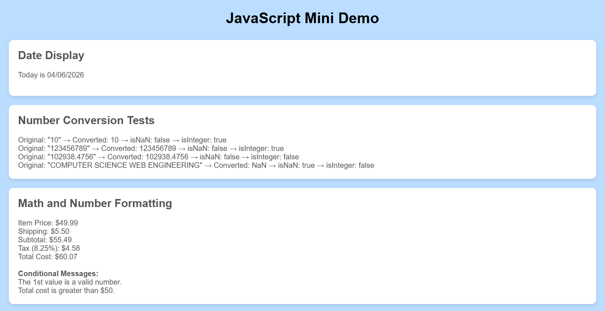

1. A list of the built-in objects and methods you used

### Date Object
- new Date()
- getMonth()
- getDate()
- getFullYear()

### Number Object
- Number()
- Number.isNaN()
- Number.isInteger()
- toFixed()

2. Your **GitHub Pages link**

https://marlonsantanacsun.github.io/COMP-484-L-HW9/

---

3. Path to a screenshot file of the finished webpage

The screenshot of the finished webpage:

---
4. A short reflection of **4-5 sentences** that answers:
   - What part was hardest?
   - What did you learn about the `Date` object?
   - What did you learn about the `Number` object?
   - What did you learn about displaying results in the browser?

- Easiest part is getting the date of today, and formatting it into the kind of date that tracks today's date.

- Hardest part is the number conversion, whereas I have to check which number or word is a NaN or is an Integer, and then display that. As I it took me a while how IsInteger and IsNaN works.

- I ended up learning about the Date object can be used to get the today's date by typing in "today", so the javascript can automatically get the corrected date without manually changing the date every day.

- I ended up up learning about the Number object having two different uses, such as when IsNaN searches for letters given, and IsInteger is used for searching numbers given.

- I ended up learning about the displaying results in the browser being a bit more unique, as you can display it even without the style.css file being used to change the display, as the script.js is the main thing doing it.